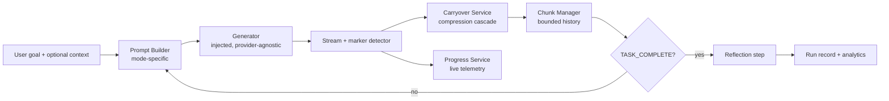

<div align="center">

# Markovian Engine

**Long reasoning in bounded chunks. O(1) context per step instead of O(n²) cumulative cost. Provider-agnostic. Production-ready.**

[](LICENSE)
[](docs/architecture.md)
[](#)

[Architecture](docs/architecture.md) · [Marker Protocol](docs/markers.md) · [Engine Tab](docs/engine-tab.md) · [Telemetry](docs/telemetry.md)

</div>

---

## The problem

Long reasoning tasks blow up your context window.

A single prompt of "build me the thing" becomes a 30,000-token prompt by step 8. Every step pays the cost of every prior step. Costs grow with the square of chain length. You get truncation, rate limits, latency cliffs, and quality drift.

Markovian fixes this.

---

## What this is

A chunked reasoning runtime that runs long tasks as a sequence of bounded steps. Each step sees:

- The original goal (truncated summary after step 1)
- A compressed **carryover state** from the previous step
- Optional first-step context (memory, attachments, workspace)

That's it. Per-step context is effectively constant. Naive full-history prompting is O(n²). Markovian is O(1) per step relative to chain length.

Two modes ship in the reference implementation:

- `ARCHITECT` for build, plan, implement tasks
- `RESEARCH` for recursive analytical work

The runtime is **provider-agnostic**. You inject a generator function. The runtime does the rest.

---

## The math

The reference savings model, applied per chunk `i`:

```
historySize           = (i - 1) * chunkSize
standardChunkCost     = historySize + chunkTokens
markovianChunkCost    = carryoverTokens + chunkTokens
chunkSavings          = max(0, standardChunkCost - markovianChunkCost)
```

For a default chain of 12 chunks at `chunkSize=8000` and `carryoverTokens=256`, the standard approach pays cumulative cost in the hundreds of thousands of tokens. Markovian pays roughly 12 × (256 + 8000). The Engine tab plots both curves live.

---

## Architecture



Every component is replaceable. The provider, the compressor, the prompt templates, the persistence layer.

---

## The marker protocol

The model signals continuation vs completion with explicit markers in its output.

| Marker | Meaning |
|---|---|
| `[STATE_CHECKPOINT]` | End of non-final chunk. Followed by concise state summary. |
| `[TASK_COMPLETE]` | Final chunk. Stop recursion. |

Backwards-compatible variants are recognized (`@@@STATE@@@`, `[STATE]`, `---STATE---`, and their final counterparts).

The UI cleans markers before rendering. The runtime uses them to decide whether to loop.

---

## The compression cascade

When extracting carryover state, the engine tries strategies in order, falling through on failure:

1. **Explicit override.** Parse the state block written by the model after the marker.
2. **Model-based compression.** Call the injected compressor with the previous state plus current chunk preview. Enforce a "3-5 critical points" style.
3. **Heuristic extraction.** Regex capture of key phrases (`Therefore`, `Key insight`, `Status`). Compress to semicolon-delimited summary.
4. **Tail truncation.** Last resort. Truncate words to the carryover token budget.

Robust against model instability, API errors, and weird outputs.

---

## Quick start

```bash
git clone https://github.com/your-org/markovian-engine.git
cd markovian-engine
# follow your stack's setup
```

Wire up a generator function with this conceptual signature:

```ts
type Generator = (
  prompt: string,
  attachments: Attachment[],
  systemPrompt?: string,
  onStream?: (delta: string) => void,
  abortSignal?: AbortSignal
) => Promise<{ text: string; metadata?: unknown }>;
```

Inject it. Configure `chunkSize`, `maxChunks`, `carryoverTokens`. Run the orchestrator. The runtime handles streaming, compression, completion, reflection, persistence, and telemetry.

Default config:

| Setting | Default | Min | Max |
|---|---|---|---|
| `chunkSize` | 8000 | 1000 | 128000 |
| `maxChunks` | 12 | — | — |
| `carryoverTokens` | 256 | 128 | 32768 |
| `overlapTokens` | 128 | — | — |

---

## What you get for free

- **Streaming UX.** Completed chunks render as markdown. Active chunk streams as plain text. Markers stripped at render time.
- **Live telemetry.** Real-time efficiency %, chain depth, tokens used, comparable standard-token estimate. Throttled at 300ms to avoid render thrash.
- **Engine tab.** Projected vs actual performance curves, config controls, chain inspector, historical run management.
- **Persistent history.** Every run recorded. Cumulative stats. Per-step aggregates. Backed by IndexedDB and local storage in the reference, swappable.
- **Reflection step.** After the chain completes, the runtime runs a synthesis pass over original goal, final carryover, full content, and code artifact summary.
- **Abort handling.** Signal checked before every chunk and before compression. Partial output preserved.
- **Memory and attachment policy.** Chunk 0 gets full attachments and memory context. Continuation chunks rely on compressed carryover.

---

## Performance reporting

The Engine tab ships two chart modes.

**Projected mode** uses theoretical curves based on current config. Useful before any runs exist. Plots cumulative cost growth for standard vs Markovian at each step.

**Actual mode** aggregates real historical runs step by step. Per-step averages include sample count. Computes real savings and real savings percent.

Auto-switches to actual mode when one or more historical runs exist.

---

## What this is not

- Not a wrapper around any one provider.
- Not a chain-of-thought prompt template.
- Not a memory system. It accepts external memory context but does not store memories itself. Pair it with [H-MEM](../h-mem) if you want both.
- Not magic. Token accounting is heuristic (`chars / 4`). Production deployments should swap in a real tokenizer.

---

## Known limitations

These are documented honestly in the reference:

- Token estimation is `chars/4`, not tokenizer-precise.
- `overlapTokens` exists in the config contract but is not active in the runtime loop yet.
- Output validation type definitions exist but are not yet wired into runtime control flow.
- Historical "actual performance" computes Markovian step cost with current config. Persist a per-run config snapshot if you want stricter historical fidelity.

---

## Integration patterns

Markovian sits behind any provider stack. Cloud API, local model, gateway, or hybrid.

Route long-form modes to the orchestrator. Route short-form requests to single-shot generation. Pick your model upstream. The runtime does not care.

---

## Service boundaries

Build it as separate modules or one binary. The contracts are the same:

- `ConfigManager` for live `ChunkConfig` and projected efficiency
- `ChunkManager` for ID allocation, storage, max-chunks enforcement
- `CarryoverService` for the compression cascade
- `PromptBuilder` for mode-specific templates
- `Orchestrator` for the streaming loop
- `ProgressService` for live telemetry
- `HistoryService` for persistent analytics

---

## Contributing

Open an issue with the failure mode before opening a PR on runtime logic. Include a chain reproduction. For new compression strategies, include the corpus you tested against.

See [`CONTRIBUTING.md`](CONTRIBUTING.md).

---

## License

MIT. Use it. Fork it. Ship it.
