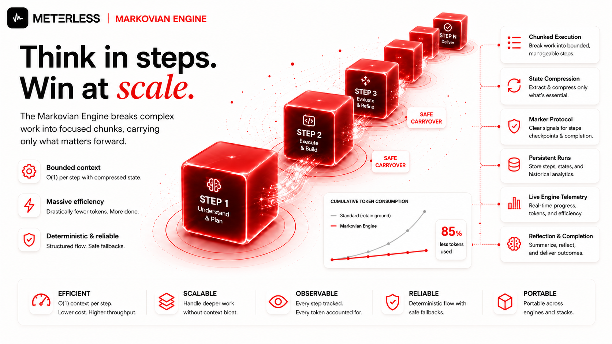
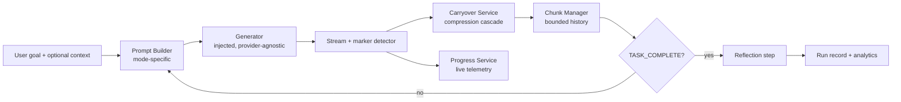
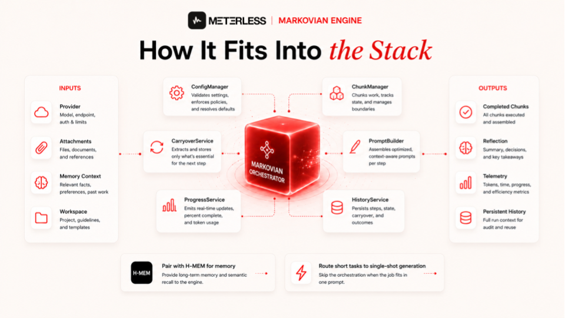

<div align="center">
  

  
# Meterless Markovian Engine

**Long reasoning in bounded chunks. O(1) context per step instead of O(n²) cumulative cost. Provider-agnostic. Production-ready. Unlock unbounded effective content windows with model overclocking.**

[](LICENSE)
[](docs/architecture.md)
[](#)

[Architecture](docs/architecture.md) · [Marker Protocol](docs/markers.md) · [Engine Tab](docs/engine-tab.md) · [Telemetry](docs/telemetry.md)

</div>

---

## The problem

Long reasoning tasks blow up your context window.

A single prompt of "build me the thing" becomes a 30,000-token prompt by step 8. Every step pays the cost of every prior step. Costs grow with the square of chain length. You get truncation, rate limits, latency cliffs, and quality drift.

Markovian fixes this.

---

## What this the Meterless Markovian Engine

A chunked reasoning runtime that runs long tasks as a sequence of bounded steps. Each step sees:

- The original goal (truncated summary after step 1)
- A compressed **carryover state** from the previous step
- Optional first-step context (memory, attachments, workspace)

That's it. Per-step context is effectively constant. Naive full-history prompting is O(n²). Markovian is O(1) per step relative to chain length.

Two modes ship in the reference implementation:

- `ARCHITECT` for build, plan, implement tasks
- `RESEARCH` for recursive analytical work

The runtime is **provider-agnostic**. You inject a generator function. The runtime does the rest.

---

## The math


The reference savings model, applied per chunk `i`:

```
historySize           = (i - 1) * chunkSize
standardChunkCost     = historySize + chunkTokens
markovianChunkCost    = carryoverTokens + chunkTokens
chunkSavings          = max(0, standardChunkCost - markovianChunkCost)
```

The standard approach is **quadratic in chain length**. The Markovian approach is **flat**. That single difference is the entire thesis.

At the production default — `chunkSize = 8000`, `carryoverTokens = 256`, 12 chunks — the standard approach pays a cumulative **~624,000 tokens**. Markovian pays roughly **12 × (256 + 8000) ≈ 99,000 tokens** to address **~96K tokens of context** at **3% compression**. Same work. **~84% saved**. And that's the *cheapest* configuration.

The engine doesn't stop there. Chunk size is the knob — turn it, and the engine moves through three distinct regimes:

| Chunk size | Carryover | Total addressable | vs Opus 4.7 (200K) | vs Gemini 3.1 Pro (1M) | Regime |
|---|---|---|---|---|---|
| 8K (default) | 256 (3%) | ~96K | 25× more room | 125× more room | **Cost optimization** |
| 32K | 2,400 (7.3%) | ~384K | 6× more room | 30× more room | **Capability extension** |
| 64K | 5,000 (7.8%) | ~768K | 3× more room | 15× more room | **Capability extension** |
| 128K (max) | 32,000 (25%) | ~1.5M | 1.5× more room | 8× more room | **Architectural advantage** |

Save money of overclock your models:

- **Below ~40K tokens of work** — native models can already do it. Markovian just makes it cheaper.
- **40K to 80K tokens** — Markovian extends 200K-class models past their native ceiling. Native windows still have better in-window coherence; Markovian wins on reach.
- **Above 80K tokens** — this is the architectural advantage zone. Markovian unlocks reasoning surfaces *beyond any native model's capacity*, on any provider, at deterministic cost.

By the time you push chain depth and chunk size together, the curves diverge violently. A 12-chunk run at 128K chunks addresses **1.5M tokens of context** — beyond Gemini's native window, beyond every Opus call you could chain by hand, beyond what any single-shot architecture can hold at once. Markovian gets there with twelve sequential reasoning passes and bounded carryover between them. The math doesn't care which provider you're on.

This is why bounded carryover is revolutionary. Every other approach to long reasoning is fighting the same fight against quadratic growth — bigger windows, smarter compression, smarter eviction. They buy time. They don't change the curve. Markovian changes the curve. Chain depth and chunk size become knobs you turn instead of walls you hit, and the engine can finally reason for as long as the problem demands instead of as long as a single context window will tolerate.

**Honest verdict:**

- **8K–32K** is a cost play. Same capability, cheaper.
- **32K–64K** is capability extension. Reach beyond the 200K class.
- **64K–128K** is architectural advantage. Reasoning surfaces no single model call can deliver.

Pick the chunk size that matches your workload's total context, latency tolerance, and cost ceiling. The Engine tab plots both curves live so you can watch the gap open in real time.

---

## Quickstart

This repo is the implementation spec, not a runtime library. You can download the `AGENTS.md` alone. Or clone the repo, open it in your coding agent, and let `AGENTS.md` guide the build into your stack.

```bash
gh repo clone meterless/markovian-engine
cd markovian-engine
# Open in Claude Code, Cursor, Codex, or any AGENTS.md-aware agent
```

Then prompt your agent: *"Implement the Markovian engine in this project following AGENTS.md."*

The agent will pick your chunk config (chunk size, carryover budget, max chunks), wire up the marker protocol, scaffold the compression cascade, stand up run history and telemetry, and leave reflection and resume as opt-in stages you can grow into. Architectural reference in `/docs`.

---

## Architecture




Every component is replaceable. The provider, the compressor, the prompt templates, the persistence layer.

---

## The marker protocol

The model signals continuation vs completion with explicit markers in its output.

| Marker | Meaning |
|---|---|
| `[STATE_CHECKPOINT]` | End of non-final chunk. Followed by concise state summary. |
| `[TASK_COMPLETE]` | Final chunk. Stop recursion. |

Backwards-compatible variants are recognized (`@@@STATE@@@`, `[STATE]`, `---STATE---`, and their final counterparts).

The UI cleans markers before rendering. The runtime uses them to decide whether to loop.

---

## The compression cascade

When extracting carryover state, the engine tries strategies in order, falling through on failure:

1. **Explicit override.** Parse the state block written by the model after the marker.
2. **Model-based compression.** Call the injected compressor with the previous state plus current chunk preview. Enforce a "3-5 critical points" style.
3. **Heuristic extraction.** Regex capture of key phrases (`Therefore`, `Key insight`, `Status`). Compress to semicolon-delimited summary.
4. **Tail truncation.** Last resort. Truncate words to the carryover token budget.

Robust against model instability, API errors, and weird outputs.

---

## Example for use

Wire up a generator function with this conceptual signature:

```ts
type Generator = (
  prompt: string,
  attachments: Attachment[],
  systemPrompt?: string,
  onStream?: (delta: string) => void,
  abortSignal?: AbortSignal
) => Promise<{ text: string; metadata?: unknown }>;
```

Inject it. Configure `chunkSize`, `maxChunks`, `carryoverTokens`. Run the orchestrator. The runtime handles streaming, compression, completion, reflection, persistence, and telemetry.

Default config:

| Setting | Default | Min | Max |
|---|---|---|---|
| `chunkSize` | 8000 | 1000 | 128000 |
| `maxChunks` | 12 | — | — |
| `carryoverTokens` | 256 | 128 | 32768 |
| `overlapTokens` | 128 | — | — |

---

## What you get for free

- **Streaming UX.** Completed chunks render as markdown. Active chunk streams as plain text. Markers stripped at render time.
- **Live telemetry.** Real-time efficiency %, chain depth, tokens used, comparable standard-token estimate. Throttled at 300ms to avoid render thrash.
- **Engine tab.** Projected vs actual performance curves, config controls, chain inspector, historical run management.
- **Persistent history.** Every run recorded. Cumulative stats. Per-step aggregates. Backed by IndexedDB and local storage in the reference, swappable.
- **Reflection step.** After the chain completes, the runtime runs a synthesis pass over original goal, final carryover, full content, and code artifact summary.
- **Abort handling.** Signal checked before every chunk and before compression. Partial output preserved.
- **Memory and attachment policy.** Chunk 0 gets full attachments and memory context. Continuation chunks rely on compressed carryover.

---

## Performance reporting


The Engine tab ships two chart modes.

**Projected mode** uses theoretical curves based on current config. Useful before any runs exist. Plots cumulative cost growth for standard vs Markovian at each step.

**Actual mode** aggregates real historical runs step by step. Per-step averages include sample count. Computes real savings and real savings percent.

Auto-switches to actual mode when one or more historical runs exist.

---

## What this is not

- Not a wrapper around any one provider.
- Not a chain-of-thought prompt template.
- Not a memory system. It accepts external memory context but does not store memories itself. Pair it with [H-MEM](https://github.com/Meterless/H-MEM/) if you want both.
- Not magic. Token accounting is heuristic (`chars / 4`). Production deployments should swap in a real tokenizer.

---

## Known limitations

These are documented honestly in the reference:

- Token estimation is `chars/4`, not tokenizer-precise.
- `overlapTokens` exists in the config contract but is not active in the runtime loop yet.
- Output validation type definitions exist but are not yet wired into runtime control flow.
- Historical "actual performance" computes Markovian step cost with current config. Persist a per-run config snapshot if you want stricter historical fidelity.

---

## Integration patterns

Markovian sits behind any provider stack. Cloud API, local model, gateway, or hybrid.

Route long-form modes to the orchestrator. Route short-form requests to single-shot generation. Pick your model upstream. The runtime does not care.

---

## Service boundaries

Build it as separate modules or one binary. The contracts are the same:

- `ConfigManager` for live `ChunkConfig` and projected efficiency
- `ChunkManager` for ID allocation, storage, max-chunks enforcement
- `CarryoverService` for the compression cascade
- `PromptBuilder` for mode-specific templates
- `Orchestrator` for the streaming loop
- `ProgressService` for live telemetry
- `HistoryService` for persistent analytics

---

## Contributing

Open an issue with the failure mode before opening a PR on runtime logic. Include a chain reproduction. For new compression strategies, include the corpus you tested against.

See [`CONTRIBUTING.md`](CONTRIBUTING.md).

---

## License

MIT. Use it. Fork it. Ship it.
